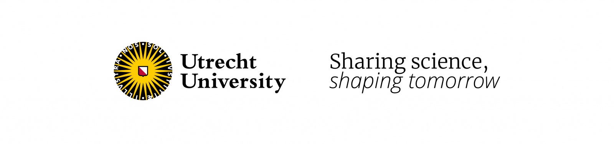

# Utrecht University Capability Model (UUCM)



## Description & Usage

The UU Capability Model (UUCM) is an anchor for assessing strategic importance, maturity, business operational pain points and capital investment.

The UUCM was developed by Utrecht University in the Netherlands based on the Higher Education Reference Model. While created specifically for Utrecht University's context, the model has been designed with adaptability in mind, allowing other higher education institutions to tailor it to their own specific needs and organizational structures.

The UUCM supports the development of strategies by viewing the business as a collection of capabilities that can be adjusted in response to the demands of the business. 

Business Stakeholders, Enterprise Architects, and Technology Strategists can use the model as a reference to engage in discussion regarding business effectiveness, needs, and challenges or technology decisions.

Furthermore, the UUCM can be enhanced with overlays and heatmaps to provide additional insights, such as target maturity, cost, risk, pace layering, and strategic importance. By leveraging the UUCM, the university can make informed decisions about where to invest resources to optimize business performance and achieve strategic objectives.

## Capabilities

A capability is a description of *what* the university does to create value. Capability Mapping is a method to structure and understand all activities of the university and the associated skills and resources.

The capabilities are organized into categories, for value streams please refer to our separate Value Stream Models.

A Capability is a combination of People, Process, Information and Technology necessary to deliver the outcomes to achieve business objectives. The capabilities support the realisation of the UU strategy.

## Repository Structure

```
├── docs/              # Documentation files
├── models/            # Capability model files
├── examples/          # Example implementations and overlays
├── templates/         # Templates for creating new overlays
├── assets/            # Images and other assets
└── README.md          # This file
```

## Getting Started

To use the UUCM, you can:

1. Explore the models in the `models/` directory
2. Check out examples of how to apply overlays in the `examples/` directory
3. Use the templates in the `templates/` directory to create your own overlays
4. Read more detailed documentation in the `docs/` directory

## Use Cases

The UUCM can be used for:

- Assessing strategic importance of capabilities
- Evaluating capability maturity
- Identifying business operational pain points
- Making informed capital investment decisions
- Supporting development of business and IT strategies
- Facilitating discussions between business and technology stakeholders

## Adaptation for Other Institutions

While the UUCM was created for Utrecht University, we encourage other higher education institutions to:

- Use this model as a starting point for developing their own capability frameworks
- Adapt the capabilities to match their specific organizational structure and priorities
- Share improvements and extensions back with the community
- Collaborate on evolving the Higher Education Reference Model for the benefit of all institutions

## License

This project is licensed under the [Creative Commons Attribution-ShareAlike 4.0 International License (CC BY-SA 4.0)](https://creativecommons.org/licenses/by-sa/4.0/).

## Want to know more?

Ccontact the UU Architecture Team via [architectuur@uu.nl](mailto:architectuur@uu.nl).

---

© Utrecht University, 2025. All rights reserved.
